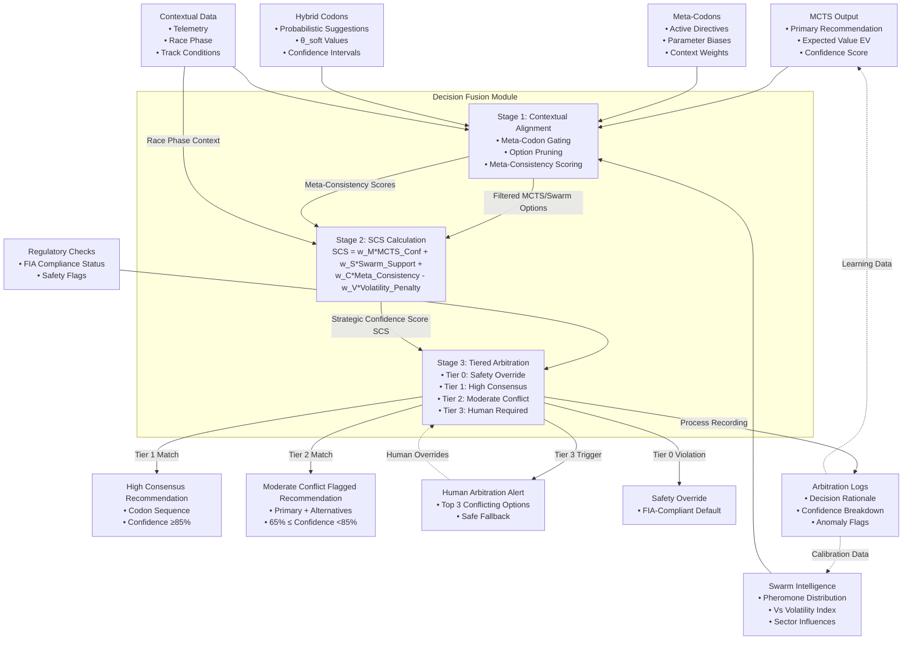

```mermaid
graph TD
%% Inputs
MCTS[MCTS Output<br>• Primary Recommendation<br>• Expected Value EV<br>• Confidence Score]
SWARM[Swarm Intelligence<br>• Pheromone Distribution<br>• Vs Volatility Index<br>• Sector Influences]
META[Meta-Codons<br>• Active Directives<br>• Parameter Biases<br>• Context Weights]
HYBRID[Hybrid Codons<br>• Probabilistic Suggestions<br>• θ_soft Values<br>• Confidence Intervals]
CTX[Contextual Data<br>• Telemetry<br>• Race Phase<br>• Track Conditions]
REG[Regulatory Checks<br>• FIA Compliance Status<br>• Safety Flags]

%% Arbitration Logic
subgraph DFM[Decision Fusion Module]
  ST1[Stage 1: Contextual Alignment<br>• Meta-Codon Gating<br>• Option Pruning<br>• Meta-Consistency Scoring]
  ST2[Stage 2: SCS Calculation<br>SCS = w_M*MCTS_Conf + w_S*Swarm_Support +<br>w_C*Meta_Consistency - w_V*Volatility_Penalty]
  ST3[Stage 3: Tiered Arbitration<br>• Tier 0: Safety Override<br>• Tier 1: High Consensus<br>• Tier 2: Moderate Conflict<br>• Tier 3: Human Required]
end

%% Outputs
REC1[High Consensus Recommendation<br>• Codon Sequence<br>• Confidence ≥85%]
REC2[Moderate Conflict Flagged Recommendation<br>• Primary + Alternatives<br>• 65% ≤ Confidence <85%]
ALERT[Human Arbitration Alert<br>• Top 3 Conflicting Options<br>• Safe Fallback]
OVERRIDE[Safety Override<br>• FIA-Compliant Default]
LOGS[Arbitration Logs<br>• Decision Rationale<br>• Confidence Breakdown<br>• Anomaly Flags]

%% Connections
MCTS --> ST1
SWARM --> ST1
META --> ST1
HYBRID --> ST1
CTX --> ST1
REG --> ST3

ST1 -->|Filtered MCTS/Swarm Options| ST2
ST1 -->|Meta-Consistency Scores| ST2
CTX -->|Race Phase Context| ST2

ST2 -->|Strategic Confidence Score SCS| ST3

ST3 -->|Tier 1 Match| REC1
ST3 -->|Tier 2 Match| REC2
ST3 -->|Tier 3 Trigger| ALERT
ST3 -->|Tier 0 Violation| OVERRIDE
ST3 -->|Process Recording| LOGS

%% Feedback Loop
LOGS -.->|Learning Data| MCTS
LOGS -.->|Calibration Data| SWARM
ALERT -.->|Human Overrides| ST3
```
